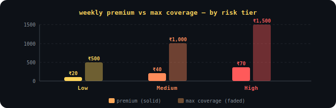
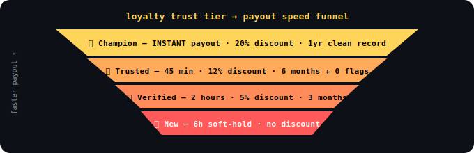
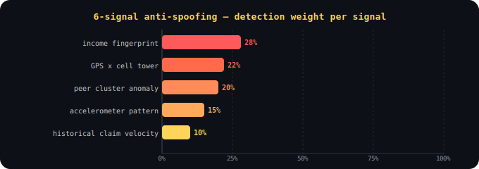

<div align="center">


<br/>

<pre>
  ██████╗   ██╗     ██████╗    ███████╗  ██╗   ██╗  ██╗  ███████╗  ██╗       ██████╗ 
██╔════╝    ██║    ██╔════╝   ██╔════╝   ██║   ██║  ██║  ██╔════╝  ██║       ██╔══██╗
██║  ███╗    ██║   ██║  ███╗   ███████╗   ████████║  ██║  ███████╗  ██║       ██║   ██║
██║    ██║  ██║   ██║    ██║  ╚═══ ═██║  ██╔═══██║  ██║  ██╔════╝  ██║       ██║  ██║
╚██████╔╝   ██║    ╚██████╔╝  ███████║   ██║   ██║  ██║  ███████╗  ███████╗  ██████╔╝
 ╚═════╝    ╚═╝     ╚═════╝   ╚══════╝   ╚═╝   ╚═╝  ╚═╝  ╚══════╝  ╚══════╝  ╚═════╝
</pre>

### *parametric income insurance. zero claims. automatic payouts. built for the rain.*


</div>

---

## the problem

a zomato partner loses ₹400 when it rains. no one pays them back. **gigshield does — automatically, before they even notice.**

---

## how it works

```
sign up → risk profiled → weekly premium set → coverage active
           ↓
        weather API triggers (rain > 50mm / temp > 42°C / AQI > 300)
           ↓
        income fingerprint + trust score computed  ← fraud layer
           ↓
        workability score drops below 40 → claim auto-fired
           ↓
        payout hits UPI. done.
```

---

## what makes gigshield different

**🧬 income fingerprinting** — personal behavioral baseline built at onboarding. if activity didn't actually drop, the claim doesn't pass. a spoofer at home keeps getting orders. a real worker doesn't.

**🌊 zone liquidity guard** — real-time pool health monitor. projected payouts threatening reserves → system soft-caps new activations before a single payout fires.

**🏆 loyalty trust score** — clean history = Champion tier = instant payout + 20% discount. fraud systems that only punish miss half the picture.

**☁️ multi-source weather consensus** — 2-of-3 source agreement (OpenWeatherMap + IMD + satellite) before any trigger fires. one bad API can't cause a false payout.

---

**⚡ disruption forecast alert** — 24h before a predicted high-risk event, workers get notified: *"tomorrow looks risky — your coverage is active."* zero action needed.

**🗺️ zone heat map** — workers see real-time red/yellow/green disruption risk by zone before starting their shift. smarter routing, fewer lost hours.

**💬 claim explainability** — after every payout, worker gets plain-language breakdown: *"67mm rain in your zone, workability score hit 31, ₹340 triggered."* radical transparency, rare in insurance.

**💰 rainy day buffer** — workers can opt to receive 80% of payout instantly, bank 20% into a GigShield micro-savings pool. unlocks as a bonus after 6 months.

---

**⏸️ premium pause** — 3+ months clean history + missed payment → auto-pause instead of cancellation. one grace week, no penalty.

**🌊 extended payout window** — during declared natural disasters (flood, cyclone), payout extends from single-day to 3-day income replacement automatically. still income, zero compliance risk.

**🎁 disruption relief credits** — during active disaster events, workers receive +2 bonus coverage hours of income protection. framed as income replacement, not aid.

**🆘 emergency contact network** — during red-alert events, platform surfaces verified local emergency numbers, shelters, and government relief portals. no money involved, just critical information when it matters most.

---

## charts

**fig 1 — weekly premium vs max coverage by risk tier**
<div align="center">

</div>

> solid bars = weekly premium paid. faded bars = max coverage unlocked.

---

**fig 2 — loyalty tier → payout speed funnel**
<div align="center">

</div>

> consistent payments + clean history → faster payouts + lower premiums.

---

**fig 3 — 6-signal anti-spoofing detection weights**
<div align="center">

</div>

> income fingerprint weighted highest (28%) — hardest signal to fake. GPS alone weighted last.

---

## tech stack

| Layer | Tech | Purpose |
|-------|------|---------|
| Backend | Python + FastAPI | requests, triggers, claims engine |
| Frontend | HTML / CSS / JS / TS | dashboard, onboarding, status |
| Database | Supabase (PostgreSQL) | users, transactions, activity logs |
| Payments | Razorpay | premium collection + UPI payouts |
| Weather | OpenWeatherMap | rain + temperature triggers |
| Air Quality | AQ API | AQI disruption triggers |
| ML — Risk | Random Forest | zone weekly risk scoring |
| ML — Pricing | Regression | risk → premium |
| ML — Behavior | LSTM / baseline deviation | income drop detection |
| ML — Fraud | Isolation Forest | anomaly + spoof detection |
| Decision | Workability Score | payout trigger (W < 40) |
| Safety | Pool Health Monitor | liquidity risk management |

**workability score:** $W = 100 - (w_r \cdot R + w_t \cdot T + w_a \cdot A)$ — fires when $W < 40$

---

## 🚨 adversarial defense & anti-spoofing

**the attack:** 500 workers. telegram group. GPS spoofer apps. fake location → storm zone → pool drained.

| Signal | Real Worker | GPS Spoofer |
|--------|------------|-------------|
| GPS location | storm zone ✅ | storm zone (faked) ✅ |
| Income fingerprint delta | orders stopped ✅ | orders still running ❌ |
| Accelerometer pattern | sheltering movement ✅ | stationary/home ❌ |
| Cell tower vs GPS match | consistent ✅ | mismatch ❌ |
| Peer cluster anomaly | organic spread ✅ | same-pincode spike ❌ |
| Historical claim velocity | normal ✅ | sudden burst ❌ |

```
trust > 0.75    → AUTO-APPROVED
trust 0.45–0.75 → SOFT-HOLD 6h (auto-resolves if weather persists)
trust < 0.45    → MANUAL REVIEW + optional 15-sec worker voice note
confirmed fraud → FLAGGED + suspended
```

> honest workers in a real flood never wait more than 6 hours.

---

## pricing

| Risk Level | Weekly Premium | Max Coverage |
|------------|---------------|--------------|
| 🟡 Low | ₹20 | ₹500 |
| 🟠 Medium | ₹40 | ₹1,000 |
| 🔴 High | ₹70 | ₹1,500 |

---

## roadmap

- [x] **Phase 1** — architecture, workflows, anti-spoofing, all feature design
- [ ] **Phase 2** — backend APIs, ML models, triggers, claims engine, frontend
- [ ] **Phase 3** — fraud models, payment simulation, dashboards, final pitch

---

<div align="center">

**gigshield. because the rain shouldn't cost them their rent.**

*Guidewire DEVTrails 2026 — built on 0 sleep and very addictive mogu mogu 🧃*

<br/>


</div>
